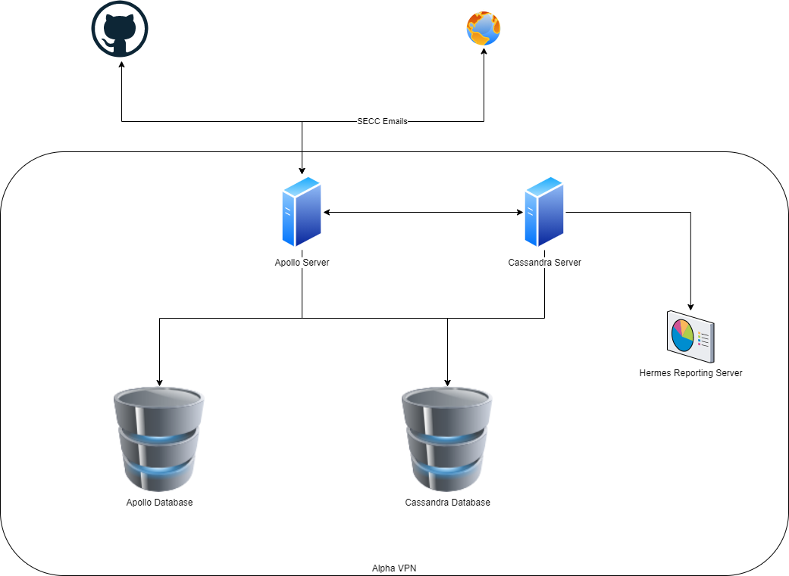

# Apollo & Cassandra

## Apollo: Central Database

The central store of all Alpha data.

Key activities it supports:

- International nomenclature is updated every three months. It's published to a Github repo which is pulled onto the Apollo server manually.
- Servicing information requests from external collaborators are accepted by email through the Secure Email Communication Convention (SECC). Requests through SECC are made in a custom domain language, sent in specially encrypted emails. Apollo decrypts these emails, stores them in its database, processes them, and then generates a new, outgoing email with any results.

## Cassandra: Prediction Engine

Cassandra is Alpha's prediction engine. Once a day it connects to the Apollo database, takes a snapshot and produces a forecast of virus developments for the next 30 days. The forecast is uploaded to a reporting server for future analysis.
