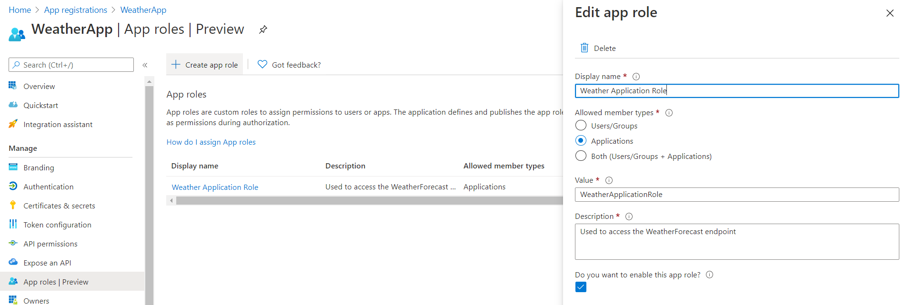
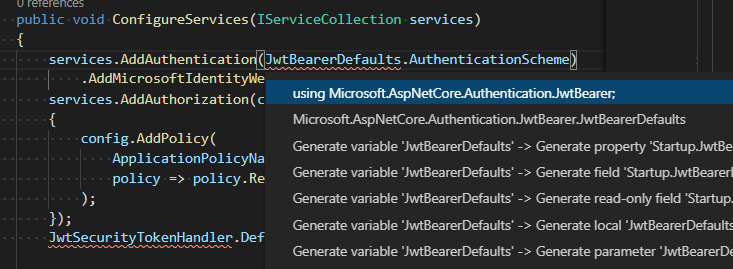
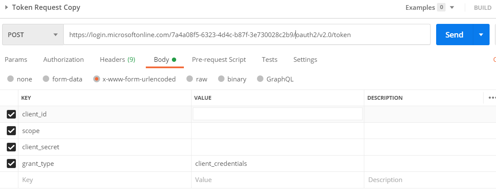
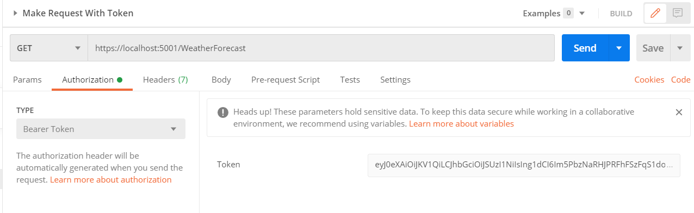

# Part 2

If you haven't completed the prerequisites in the [README](./README.md) do so now.

## Part 1 - Protected web API

We want to create a web api which is protected by [Azure Active Directory authentication](https://docs.microsoft.com/en-us/azure/active-directory/authentication/overview-authentication#:~:text=One%20of%20the%20main%20features,of%20a%20username%20and%20password.).
That means it shouldn't be possible to access the api without a valid authentication token. We'll use Azure services to generate and verify the token.

### 1.1: Setup the web API

This repository contains code for a simple .NET Core web API.
It exposes one GET endpoint, WeatherForecast, which will return a randomly generated weather forecast for the next five days.
As you'll be building on this code, it's recommended that you [fork](https://docs.github.com/en/github/getting-started-with-github/fork-a-repo) the repository like you did for workshops 7 and 8.

You don't need to worry too much about what the code is doing for now, however you should be able to build and run the app.

1. Run `dotnet build` from the terminal in the project folder.
2. Run `dotnet run` from the terminal in the project folder.
3. Go to https://localhost:5001/swagger/index.html in the browser. This loads a [Swagger UI](https://swagger.io/tools/swagger-ui/) page. Swagger UI is a useful tool to test API endpoints. To test this API click the "/WeatherForecast" row then "Try it out" then "Execute". You should then be able to see the response from the endpoint.


### 1.2: Create Azure AD Tenant

The first step is to create an Azure AD Tenant. A tenant in this case is an instance of Azure Active Directory.

Follow [these instructions](https://docs.microsoft.com/en-us/azure/active-directory/develop/quickstart-create-new-tenant#create-a-new-azure-ad-tenant) to create a tenant to use. In particular you want to create a new Azure AD Tenant, you don't want to use an existing one.

*Note* - Make sure you have switched to the new tenant afterwards. You can do that by:
* Clicking your name in the top right corner
* 'Switch directory'
* Selecting your new tenant's directory

### 1.3: Create an app registration for a protected web API

The next step is to create an app registration for the web API we're going to use. We need to do this so that we can verify the authentication token sent to our API is valid. To do this we register our application with our tenant as a protected web api.

In particular we want to configure it so that the data provided by the API can be consumed by another app securely using tokens, without needing a user to log in first.

Here are the steps for setting up the web API application in Azure:

1. Create a new app registration (from [this page on Azure](https://go.microsoft.com/fwlink/?linkid=2083908)).
    * Use `WeatherApp` as the app name and leave **Supported account types** on the default setting of **Accounts in this organizational directory only**.
2. After registering click **Expose an api** and on **Application ID URI**, click on **Set**. Keep the suggested value, for example `api://<web api client id>`
3. Create an app role as follows:


### 1.4: Add authentication to a web API

Now we need to add some code to our API so that it will only allow requests with the correct authentication.

**Add the Azure AD config from the app registration to the app.**

This should be provided in the `appsettings.json` file. Update this file to include the following information:

```json
{
  "AzureAd": {
    "Instance": "https://login.microsoftonline.com/",
    "ClientId": "CLIENT_ID",
    "TenantId": "TENANT_ID"
  },
  ...
}
```

You can find the client id and tenant id on the overview page for your app registration in the Azure portal. See [this guide](https://docs.microsoft.com/en-us/azure/active-directory/develop/scenario-protected-web-api-app-configuration#config-file) for more details.


**Configure the app to use authentication.**
These changes need to be made in `Startup.cs`. You need to update the `ConfigureService` method to include the following:

```csharp
public void ConfigureServices(IServiceCollection services)
{
    services.AddAuthentication(JwtBearerDefaults.AuthenticationScheme)
        .AddMicrosoftIdentityWebApi(Configuration.GetSection("AzureAd"));
    services.AddAuthorization(config =>
    {
        config.AddPolicy(
            "ApplicationPolicy",
            policy => policy.RequireClaim(ClaimConstants.Roles, "WeatherApplicationRole")
        );
    });
    JwtSecurityTokenHandler.DefaultMapInboundClaims = false;

    ...
}
```

You will also need to import the relevant libraries. VSCode will fix this for you automatically if you click on the missing import (highlighted in red) and then press Ctrl/Cmd + FullStop. Note that if you turn on the 'Enable Import Completion' setting on (File -> Preferences -> Settings -> Extensions -> C# -> Omnisharp: Enable Import Completion) then these imports will be added automatically when selecting a completion option.



This sets up the authentication using the config values from appsettings.json (passed in through the IConfiguration object).

You also need to update the `Configure` method so that it adds authentication and authorization to the app:

```csharp
public void Configure(IApplicationBuilder app, IWebHostEnvironment env)
{
    ...

    app.UseRouting();

    app.UseAuthentication();
    app.UseAuthorization();

    ...
}
```

See [this guide](https://docs.microsoft.com/en-us/azure/active-directory/develop/scenario-protected-web-api-app-configuration#starting-from-an-existing-aspnet-core-31-application) for more details.

**Add authentication to the `WeatherForecast` endpoint.**
You can do this by using the `Authorize` attribute on the class:

```csharp
[Authorize(Policy = "ApplicationPolicy")]
[ApiController]
[Route("[controller]")]
public class WeatherForecastController : ControllerBase
```

The name of the policy (`"ApplicationPolicy"` in this case) can be whatever you want but it needs to match the name of the policy you define in the `ConfigureServices` method. Adding the `Authorize` header with that policy will ensure that only a request with a valid token which is for `WeatherApplicationRole` will be able to hit the endpoint.

The API should now be protected. If you try to hit the endpoint again through Swagger UI, you should get a 401 error response. This means that the request has been rejected because you didn't provide the correct authentication.

You'll see in the next part how we can add a valid authentication token to the request.

## Part 2 - Access a protected web API

### 2.1: Create an app registration for a client accessing the web API

To generate a valid token we first need to create a second app registration in the Azure portal. This is to register the application which will be requesting access to the API. 

Create a new app registration called `WeatherAppConsumer` (feel free to name it something else if you prefer!).
* Once created, add a new **client secret** from the **Certificates & secrets**

Next you'll need to grant API permission for the new application to access the first app registration you created.
* Select **API permissions** => **Add a permission** => **My APIs** then click on your app and the role you created earlier (`WeatherApplicationRole`) 
* **Make sure you grant admin consent for the tenant on the API permissions page**. As you created the tenant you should have admin permissions to do so.

### 2.2: Get a token to access the web API

You should now be able to request a token to access the API. See [here](https://docs.microsoft.com/en-us/azure/active-directory/develop/v2-oauth2-client-creds-grant-flow#first-case-access-token-request-with-a-shared-secret) for what the request should look like. 

The structure of the request in Postman will look like the following:



In particular:

- The tenant id should be from the tenant you created in part 1. You can find this on the overview page for either of the app registrations you've created.
- The client id should be the client id for the app registration you created in step 2.1.
- The scope should be the application ID URI from the first app registration you created in step 1.3 followed by "/.default"
    - Note that *if you are not using Postman* it needs to be URI encoded. For example `api%3A%2F%2F40ae91b7-0c83-4b5c-90f3-40187e8f2cb6%2F.default` would be the correct scope for application ID URI api://40ae91b7-0c83-4b5c-90f3-40187e8f2cb6. You can find the application ID URI by going to the "Expose an API" section for your first app registration in the Azure portal.
- The client secret should be the one you created in step 2.1.

Once you get a successful response copy the access token from it. You're going to use this in the request to your web API.

### 2.3: Send a request to the web API

Now you just need to add the token from the previous step to your request to the API. This can either be done via Swagger or Postman:

### Using Swagger

With the web API running and the Swagger UI page open you should see an "Authorize" button. The button should currently have an unlocked padlock icon on it, which means that no authorization token has been added. Once you click the button a popup should appear where you can enter the token. Make sure to include "Bearer" but don't include quotes. So for example:

```
Bearer eyJ0eXAiOiJKV1QiLCJ...
```

After you've entered the token click "Authorize". This should close the popup and the "Authorize" button should now have a closed padlock icon on it. When you now send a request through Swagger it should include the token and the request should be accepted.

### Using Postman

Create a GET request with an authorisation type of Bearer Token:



### 2.4: Write a script to send a request to the web API

Instead of having to manually get a token and add it to the request, write a python script to do it for you. The script should:

1. Send a POST request to get a token to access the web API, as you did manually in step 2.2.
2. Use the token to send a GET request to the web API.
3. Print the response from the web API.

NB you might see an error "certificate verify failed" when making the request to the web API from your script. Running `dotnet dev-certs https --trust` in the terminal should fix this, as it should make your machine trust the dev certificates the web API is using. However it doesn't always work and you might not be able to run the command if you don't have admin rights. Another way to fix it is by turning off certificate verification for the request, e.g. by passing in `verify=False` to the `requests.get` method. We wouldn't do this on a deployed app but in this case we'll only be running the script locally.

## (Stretch Goal) Part 3 - Webpage accessing a protected API

We now want to build a simple webpage to show the weather forecast from our API. This webpage should:

1. Prompt the user to log in to their Microsoft account, if they haven't signed in already
2. Get an access token for the web API on behalf of the user
3. Get a weather forecast from the API and display it to the user

You can build this webpage using whatever language and tech stack you want. Two options would be to use python + flask, or typescript + express.

### 3.1: Create an app registration for the webpage

To enable login and access to the API we need to create yet another app registration in the Azure portal. To do this follow the instructions [here](https://docs.microsoft.com/en-us/azure/active-directory/develop/scenario-spa-app-registration), choosing "Redirect URI: MSAL.js 2.0 with auth code flow".

Once you've created the app registration and set the redirect, you need to give it permission to access the API. You can do this in the same way as for the app registration used in the python script, with a few differences:

1. On your original app, go to "Expose an API" and add a scope, named "access_as_user"
2. On your webpage app registration, go to API permissions -> add permission -> my APIs -> select the app registration for your API
3. Select _"delegated permissions"_ instead of "application" which you selected last time. This is because the webpage be accessing the API on behalf of a user, instead of as a daemon application.
4. Make sure you grant admin access like you did for the app registration used in the python script.

### 3.2: Create a web app

Now create a simple web app. It should only expose one url, e.g. http://localhost:3000. For now you can display whatever you want on that page, for example "Hello, world".

### 3.3: Generate a verifier and code challenge

To do the login step you need a verifier. The verifier is a 43 character string. You'll encode this string and send it along with the login request. After the login request succeeds you make another request to get a token. When you make this request you send the verifier again, but this time not encoded. The auth service will then decode the encoded verifier you sent with the first request and check that it matches the one you sent to get the token. If they don't match then the request to get the token will fail.

This verifier can be any 43 character string. It's good practice to make it a random string but you could also hardcode it.

Once you've got a verifier you need to encode it so that it can be used in the login request as the code challenge parameter. You should encode it using SHA256. You'll probably need a library to do this, [here](https://gist.github.com/jo/8619441) is a list of good libraries to use with javascript/typescript, for python you can use the [hashlib module](https://docs.python.org/3/library/hashlib.html) which is part of the standard library. The resulting encrypted string should also be 43 characters long.

Generating a random string, making sure the length is correct both before and after encrypting, can be a bit tricky.

A good way to do this in Python is:

1. Generate a string from a random 32 bytes, e.g. by using `secrets.token_urlsafe(32)` with the `secrets` module
2. To generate the challenge, we first hash those bytes using the `hashlib.sha256` function - note that you will need to encode the verifier string first
3. And then base64 encode the hash, decode it and remove any padding (any `=`)
```python
challenge_bytes = base64.urlsafe_b64encode(sha.digest())
challenge_string = challenge_bytes.decode('utf-8').replace('=', '')
```

Or alternatively for javascript/typescript:

1. Create a helper method which will convert bytes to a base 64 string, remove base 64 padding and url encode it. For example in javascript using `crypto-js` this would be:

```
function base64UrlEncode(bytes: crypto.lib.WordArray): string {
    return bytes.toString(crypto.enc.Base64)
        .replace(/\+/g, '-')
        .replace(/\//g, '_')
        .replace(/=/g, '');
}
```

2. Generate 32 random bytes. For example by using `crypto.lib.WordArray.random(32)` with `crypto-js`.
3. Convert the bytes to a string using your helper method. The resulting string is your verifier.
4. To generate the code challenge first encrypt the verifier using SHA256. For example by using `crypto.SHA256(verifier)` with `crypto-js`.
5. Then convert the resulting bytes to a string using your helper method again. The resulting string is your code challenge.

### 3.4: Add login to your webpage

You're now ready to add login to your webpage. This should work by using some query parameters, `code` and `state`. When the webpage is first loaded it will redirect to a login url. Once login has succeeded the auth service will redirect back to your webpage but with the query parameters `code` and `state` set. So you can check whether those query parameters are present to determine whether or not the user has been logged in.

1. Create some string to use as your state. This can be any string. You could generate a random string as for the verifier, but this time the length isn't important.
2. When loading your page check if the url include the query parameters `code` and `state`, and whether the `state` parameter equals the state string you generated. If those checks succeed then show a success message.
3. If the url didn't include those query parameters then you need to redirect to login.

You can redirect to login by sending a GET request to the url described in the "Request an authorization code" section of [this guide](https://docs.microsoft.com/en-us/azure/active-directory/develop/v2-oauth2-auth-code-flow#request-an-authorization-code). Out of these parameters:

- `tenant` is the tenand id you've already used. This can be found in the overview page for any of your app registrations in the Azure portal.
- `client_id` is the client id for the app registration you created in step 3.1.
- `response_type` should be `code`.
- `redirect_uri` should be the url for your webpage, e.g. http://localhost:3000.
- `scope` should be the same scope you used in the python script, except with `access_as_user` at the end instead of `.default`.
- `response_mode` should be `query`, indicating that we're expecting query parameters to be set once login has completed.
- `state` should be the `state` string you created.
- `prompt` can be left out.
- `login_hint` can be left out.
- `domain_hint` can be left out.
- `code_challenge` should be set to the code challenge you generated in step 3.3.
- `code_challenge_method` should be set to `S256`.

### 3.5: Request a token once login succeeds

To be able to access the weather forecast API you need to get an access token. So instead of showing a success message if login succeeds, make a POST request to get an access token and display the token on the page.

See the "Request an access token" section of [this guide](https://docs.microsoft.com/en-us/azure/active-directory/develop/v2-oauth2-auth-code-flow#request-an-access-token) for details of the url to send the POST request to and the format of the request body.

In particular:

- The headers of the request need to have `Content-Type` set to `application/x-www-form-urlencoded` and `Origin` set to the url of your webpage (e.g. http://localhost:3000).
- The body of the request needs to be a url encoded string, formatted like a list of query parameters. For example `client_id=CLIENT_ID&scope=ENCODED_API_SCOPE&code=CODE&redirect_uri=ENCODED_REDIRECT_URL&grant_type=authorization_code&code_verifier=VERIFIER`.
- The client id, scope, redirect uri and verifier are the same as in the login url.
- The code should be the value of the `code` query parameter, set when login succeeds.

### 3.6: Update the web API to allow access by user

Currently our web API is configured to only allow access with a token generated for an application. However we'll be generating a token for a user. Therefore we need to slightly tweak the authorization we've added to the web API.

In particular change the policy to:

```
config.AddPolicy(
    "UserPolicy",
    policy => policy.RequireClaim(ClaimConstants.Scp, "access_as_user")
);
```

And update the policy name the `WeatherForecastController` uses:

```
[Authorize(Policy = "UserPolicy")]
[ApiController]
[Route("[controller]")]
public class WeatherForecastController : ControllerBase
```

If you want to still be able to access the API from your script you can add a new policy instead of changing the existing one (so add the `config.AddPolicy` statement above but also keep the existing `config.AddPolicy` statement). Then you can just change which policy the `WeatherForecastController` uses if you want to access it from your script or from swagger.

You could also change the policy so it will allow access by an application and by a user. The syntax for this is a bit more complicated as you need to check that the token either has a scope claim set to "access_as_user" or a roles claim set to "access_as_application". To do that you need to use `policy.RequireAssertion` instead of `policy.RequireClaim`, see [this doc](https://docs.microsoft.com/en-us/aspnet/core/security/authorization/policies?view=aspnetcore-5.0#use-a-func-to-fulfill-a-policy) for more details.

### 3.7: Get a weather forecast from the API

Now you should be able to make a request to the API from your webpage. So instead of displaying the token once login has succeeded, use the token to make a GET request to the WeatherForecast API endpoint. This will be similar to what you did in the python script. You might run into SSL certificate verification issues again, in which case remember to turn off SSL certificate verification for that request.

Then display the weather forecast to the user.
